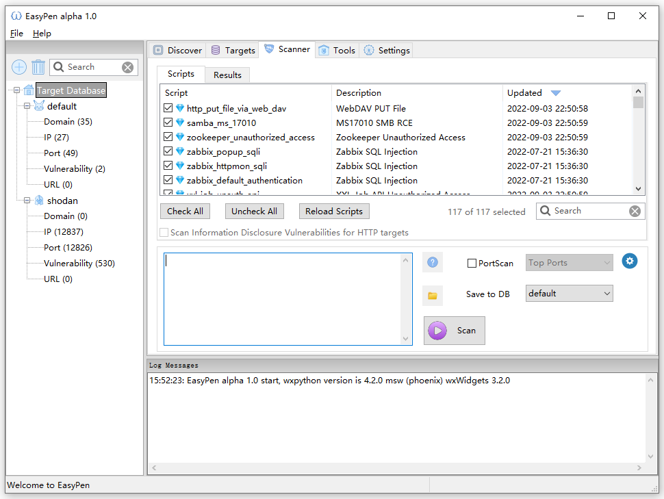
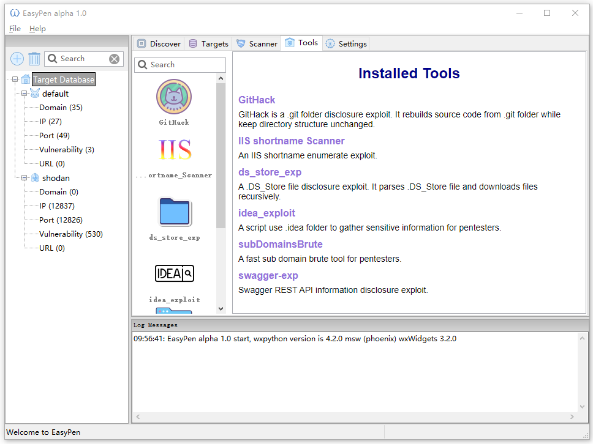

<div align="center">

</div>

# EasyPen Alpha 1.0.4

> 请勿将EasyPen用于非法用途，本工具仅供安全研究和企业巡检自查

[This doc in English](https://github.com/lijiejie/EasyPen/blob/main/README.md) 

`EasyPen`是使用Python + wxPython编写、提供简洁图形界面、支持跨平台的安全扫描工具，可用于企业内外网巡检、应急响应、白帽子对各SRC的持续检测。

其内置超过100个漏洞检测插件，用户可以自写插件，并快速应用于大范围扫描。

**用户手册**： https://easypen.lijiejie.com/   

### 更新日志

* 2022-09-16: Bug Fix: Targets input missing `is_http`.
* 2022-09-15: Bug Fix: DNS log monitor object overwrite, brute job shouldn't create dns log monitor.
* 2022-09-13: Bug fix: hydra plugin works with a hard code `timeout`. 
* 2022-09-12: important bug fix, asyncio timeout failed to gather returned vulnerabilities. 

### 安装

Windows 可以下载运行生成的可执行文件，解压后运行 `EasyPen.exe` : https://github.com/lijiejie/EasyPen/releases

熟悉Python的用户可以使用 pip3 安装

```
pip3 install -r requirements.txt
```

> 本工具主要使用Python3.8开发测试, 请使用 Python3.8 安装运行本程序

**Ubuntu 用户安装依赖工具**

```
apt install masscan nmap hydra medusa nfs-common ipmitool rsync -y
```

**CentOS 用户安装依赖工具**

```
yum install masscan nmap nfs-utils ipmitool rsync -y

安装 hydra: https://github.com/vanhauser-thc/thc-hydra
或者安装 medusa: https://github.com/jmk-foofus/medusa
```

### 核心功能

* **资产发现**：域名、IP、端口、服务的发现，构建资产库，用于后续扫描
* **漏洞扫描**：基于AsyncIO实现的扫描框架，内置超过100个漏洞检测插件，支持调度Hydra/Medusa/Ncrack扫描常见弱口令
* **应急响应**：高危漏洞爆发后，依托框架和现成资产库，通常只需要编写十余行检测逻辑代码，就可以在几分钟内完成对数千目标的扫描
* **漏洞利用**：集成多个漏洞利用工具


**扫描面板截图**




**工具面板截图**



### 开发计划

目前Alpha 1.0 完成了基础的框架开发，待开发完善的功能

* 适配支持各类DNSLog平台，计划增加联动 [Antenna漏洞验证平台](https://github.com/wuba/Antenna) （ https://github.com/wuba/Antenna） 
* 集成web指纹识别功能，标签功能（Server / Shiro / PHP / Java 等），可视化预览
* 维护预置扫描模板（插件集合名称）
* 添加第三方插件的执行支持，如：python / YAML 插件，支持复用其他开源项目插件
* 简易插件编辑和调试功能
* 漏洞查看界面一键复核验证功能（漏洞依然存在则高亮显示）
* 优化暴力破解相关，包括字典维护
* BBScan插件的集成
* 扫描性能持续提升
* 重构代码便于其他贡献者增加工具、插件